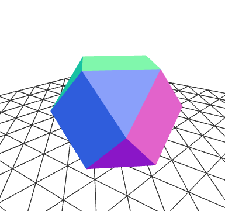

## 3D models of crystal growth habits

A collection of polyhedra, many of which describe crystal growth habits. 
Print some as gifts for your favourite geologist.

* Made using [OpenSCAD](https://openscad.org) scripts.

* STL and 3mf files available also.

* The STL files can be previewed in github website.

- Shapes include:
  - Cube
  - Octahedron
  - Rhombic dodecahedron
  - Gallena
  - Olivine
  - Sessartine

